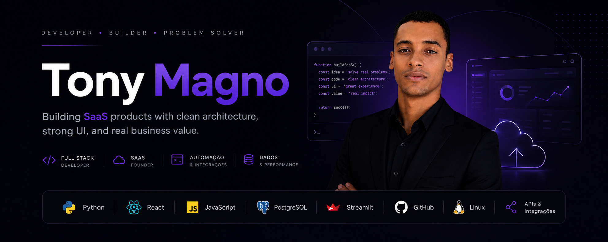

<!-- PROFILE HEADER -->

  

  <strong>Full Stack Developer | Front-End Engineer | IT Support | Automation | UI/UX</strong>

  Building modern, scalable, and results-driven solutions with a focus on product, performance, and user experience.

  
  

---

## About Me

I am a technology professional focused on **web development, technical support, automation, and software engineering**.

My approach combines:
- logical thinking;
- architectural organization;
- clean code;
- attention to detail;
- product mindset;
- practical and functional delivery.

I work on solutions that connect **business, technology, and user experience**.

---

## What I Do

- Modern and responsive **Front-End** development
- **Full Stack** development
- Professional interfaces focused on UX/UI
- API and database integration
- Process and script automation
- Technical support and system diagnostics
- Structuring scalable projects
- Software engineering best practices

---

## Tech Stack

### Languages

  

### Front-End

  

### Back-End / Database

  

### DevOps / Tools

  

### Other Skills
- Git / GitHub
- Linux
- PowerShell
- SEO
- Responsive Design
- Debugging
- CI/CD
- Agile / Scrum
- Software Architecture
- IT Support
- Networking fundamentals

---

## Featured Projects

### 1. Orçamento Premium
A system focused on quotation management and automation, with an emphasis on organization, productivity, and scalability.

### 2. Professional Web Portfolio
A personal project focused on career presentation, technical branding, and opportunity conversion.

### 3. Lumine Joias 2025
A website focused on visual presentation, browsing experience, and brand positioning.

### 4. YnoHost TI
A project with an identity focused on technology services, infrastructure, and support.

### 5. Dark Money Robô Dólar B3
A project focused on automation and market operations logic for the financial market.

> More projects are in constant evolution, always seeking quality, clarity, and real impact.

---

## Current Focus

I am deepening my work in:
- digital product development;
- building a strong portfolio for global opportunities;
- modern web solutions;
- intelligent automation;
- systems architecture;
- continuous improvement in performance and code organization.

---

## Goals

My goal is to build a solid portfolio with projects that demonstrate:

- real technical capability;
- business understanding;
- mastery of modern technologies;
- professional delivery;
- consistent growth;
- readiness for national and international opportunities.

---

## GitHub Stats

  
  

  

---

## Contact

- GitHub: [tonymagno](https://github.com/tonymagno)
- LinkedIn: [https://www.linkedin.com/in/tony-magno-07112913b?utm_source=share_via&utm_content=profile&utm_medium=member_android]
- Portfolio: [portfolio-interativo-taupe.vercel.app]
- E-mail: [tony_brak@hotmail.com](mailto:tony_brak@hotmail.com)

---

## Philosophy

> Code with clarity. Build with purpose. Deliver with discipline.

  <strong>Always improving. Always building. Always shipping.</strong>

